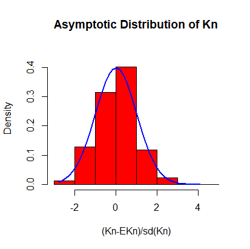

---
## Contents

1. Stick-Breaking and Chinese Restaurant Process
2. Data Generating and Power Law
3. Dirichlet Process Mixture Models
4. Gibbs Sampling Algorithms
5. Simulation results

<!-- --- &radio -->

<!-- ## Who has higher creativity? -->

<!-- Who has higher creativity? -->

<!-- 1. Man -->
<!-- 2. Woman -->
<!-- 3. Engineer -->
<!-- 4. Artist -->

<!-- *** .hint -->
<!-- Creativity Diversity -->

<!-- *** .explanation -->

--- 

## Dirichlet Process

$DP$ is a random measure defined as $$\mu = \sum^{\infty}_{n=1} p_n \delta_{\phi_n}, $$ where $(p_n)_{n\in N}$ are random weights by stick-breaking construction with parameter $\theta$ and $(\phi_n)_{n\in N} \overset{iid}{\sim} G_0$ "the base measure". 

Therefore, $\mu \sim DP(\theta, G_0)$ has following repressentation: 

$$\begin{array}
  {rl}
  \mu & = \;  \displaystyle \sum^{\infty}_{i=1} \Big[ V_i \prod^{i-1}_{j=1}(1-V_j) \Big] \delta_{\phi_i} \\
  V_i & \overset{iid}{\sim} \; Beta(1, \theta) \\
  \phi_i & \overset{iid}{\sim} \; G_0
  \end{array}$$

---

## Stick-Breaking and CRP

1. CRP Theorem 10.5: $\text{lim}_{n\rightarrow\infty}K_n/\text{log}n = \theta$ almost surely. 
2.  
3.
4. 

```{r echo = F, results = 'asis', fig.width=6, fig.height=5, fig.align='center'}
load(file = "data/Them10_5.Rdata")
plot(Them10_5$ratio~Them10_5$n, type="l")
```

---

## MCMC & Gibbs Sampler

1. **Markov chain Monte Carlo simulation(MCMC):** is a general method based on drawing values of θ from approximate distributions and then correcting those draws to better approximate the target posterior distribution, p(θ|y). 

2. **Gibbs Sampler:** also called alternating conditional sampling. Each iteration draws each subset conditional on the value of all the others ($\theta = (\theta_1, \cdots , \theta_d)$).

<center>

```{r echo = F, results = 'asis', fig.width=10,fig.height=7, fig.align="center"}

```

---

## Statistical results

- The differences in **IFF/Attempt** between gender are not significantly different.

```{r echo = F, results = 'asis', fig.width=10,fig.height=7, fig.align="center"}

```

---

## Statistical results

- The differences in **Creative outcome/T-value** between countries are significantly different. 

```{r echo = F, results = 'asis', fig.width=10,fig.height=7, fig.align="center"}

```

---

## Statistical results

- The differences in **Attempt** between countries are significantly different. 

```{r echo = F, results = 'asis', fig.width=10,fig.height=7, fig.align="center"}

```

---

## Online application and products

1. [Creative style online estimation](http://ameveryone.com/shiny/Creativity/)
2. [R package: DataClean](https://cran.r-project.org/web/packages/DataClean/)

<center>

---

## Recommended courses:
1. [Creativity, Innovation and Changes -- Penn State University](https://www.coursera.org/learn/creativity-innovation)
2. [Machine Learning -- Stanford University](https://www.coursera.org/learn/machine-learning/home/info)
3. [Developing Data Products -- The Johns Hopkins University](https://www.coursera.org/learn/data-products/home/welcome) 
