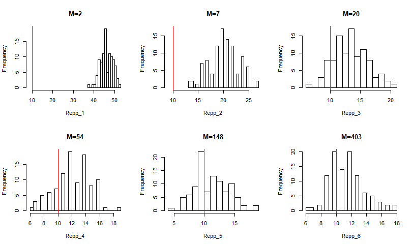
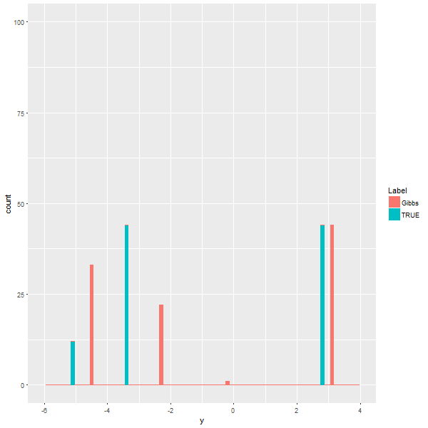

---
## Contents

1. Stick-Breaking and Chinese Restaurant Process
2. Dirichlet Process Mixture Models
3. Conjugate Prior
3. Gibbs Sampling Algorithms
4. Simulation results

<!-- --- &radio -->

<!-- ## Who has higher creativity? -->

<!-- Who has higher creativity? -->

<!-- 1. Man -->
<!-- 2. Woman -->
<!-- 3. Engineer -->
<!-- 4. Artist -->

<!-- *** .hint -->
<!-- Creativity Diversity -->

<!-- *** .explanation -->

--- 
## Dirichlet Process

$DP$ is a random measure defined as: $$\mu = \sum^{\infty}_{n=1} p_n \delta_{\phi_n}, $$ where:

- $(p_n)_{n\in N}$ are random weights by stick-breaking construction with parameter $\theta$
- and $(\phi_n)_{n\in N} \overset{iid}{\sim} G_0$ is "the base measure". 

Therefore, $\mu \sim DP(\theta, G_0)$ has following repressentation: 

$$\begin{array}
  {rl}
  \mu & = \;  \displaystyle \sum^{\infty}_{i=1} \Big[ V_i \prod^{i-1}_{j=1}(1-V_j) \Big] \delta_{\phi_i} \\
  V_i & \overset{iid}{\sim} \; Beta(1, \theta) \\
  \phi_i & \overset{iid}{\sim} \; G_0
  \end{array}$$


---
## Stick-Breaking construction

Let $(V_n)_{n\in N}$ be i.i.d. $\text{Beta}(1,\theta)$ random variables.

That is, $P(V_1\in dx) = \theta (1 − x)^{\theta−1} \textbf{1}_{{x\in (0,1)} }dx.$

Consider:

$$\begin{array}
  {rl}
  P_1 & := \;  V_1 \\
  P_2 & := (1-V_1)V_2 \\
  P_3 & := (1-V_1)(1-V_2)V_3 \\
      & \vdots \\
  P_{n+1} & := \displaystyle V_n \prod^{n-1}_{j=1}(1-V_j)
  \end{array}$$


---
## Stick-Breaking construction

<!-- <center></center> -->
<center></img></center>

---
## Chinese Restaurant Process (CRP)

- Imagine a Chinese restaurant that has unlimited number of tables.
- First customer sits at the first table.
- Customer $n$ sits at: 
  - Table $k$ with probability $n_k/(\alpha_0+n−1)$, where $n_k$ is the number of customers
at table $k$.
  - A new table $k + 1$ with probability $\alpha_0/(\alpha_0+n−1)$

In this metaphor, customers are analogies of integers and tables of clusters. This process can also be summarized as follows:
$$p(c_n=k|c_{1:(n-1)}) = \{ \begin{array}
  {l}
  \frac{n_k}{\alpha_0+n−1 },  \; \text{if occupied table;} \\
  \frac{\alpha_0}{\alpha_0+n−1}, \; \text{if new table} 
  \end{array} $$

---
## Animation of CRP

<!-- <center></center> -->
<center></img></center>


---
## Simulation of Asymptotics

Asymptotics of $K_n$: Number of clusters

- **Theorem:** $\displaystyle \text{lim}_{n\rightarrow\infty}K_n/\text{log}n = \theta$ almost surely.

```{r echo = F, results = 'asis', fig.width=6, fig.height=5, fig.align='center'}
load(file = "data/Them10_5.Rdata")
plot(Them10_5$ratio~Them10_5$n, type="l", xlab="Sample Size: n", ylab = "Kn/log(n)", main=expression("Simulation of "*theta[0]*" is 2"))
```

---
## Simulation of Asymptotics

- **Theorem:** Asymptotic distribution of $K_n$: $$\frac{K_n-\mathbb{E}K_n}{\sqrt{\text{Var}(K_n)}} \Rightarrow \mathcal{N}(0,1)$$

<center>

---
## MCMC & Gibbs Sampler

1. **Markov chain Monte Carlo simulation(MCMC):** is a general method based on drawing values of $\theta$ from approximate distributions and then correcting those draws to better approximate the target posterior distribution, $p(\theta|y)$. 

2. **Gibbs Sampler:** also called alternating conditional sampling. Each iteration draws each subset conditional on the value of all the others $(\theta = (\theta_1, \cdots , \theta_d))$.

---
## Conjugate Prior is importants

If the posterior distributions $p(\theta|x)$ are in the **same family as the prior probability distribution** $p(\theta)$ , the prior and posterior are then called conjugate distributions, and the prior is called **a conjugate prior** for the likelihood function.

**Model parameter** $\mu$: mean of Normal with known variance $\sigma^2$. 

Prior of $\mu$ is $\mathcal{N}(\mu_0, \sigma^2_0)$

By derivation, posterior distribution is :

$$\mathcal{N}\Bigg(\Bigg(\frac{1}{\sigma _{0}^{2}}+\frac{n}{\sigma ^{2}} \Bigg)^{-1} \Bigg(\frac{\mu _{0}}{\sigma _{0}^{2}}+\frac{\sum _{i=1}^{n}x_{i}}{\sigma^{2}}\Bigg),\Bigg(\frac {1}{\sigma _{0}^{2}}+\frac{n}{\sigma ^{2}}\Bigg)^{-1}\Bigg)$$

---
## DPMM & Gibbs Sampler Algorithm

Simple Mixture Model: $$\begin{array} {l}
y|\theta_i \sim \mathcal{N}(\theta_i, 1) \\
\theta_i \sim G \\
G \sim DP(\alpha, G_0) \\
G_0 \sim \mathcal{N}(0,2) 
\end{array}$$

- Likelihood function: $F(y_i|\theta) = \frac{1}{\sqrt{2\pi}}e^{\frac{1}{2}(y_i - \theta)^2}$

- Posterior distribution $H_i = p(\theta|y_i)= \frac{F(y_i|\theta)G_0(\theta)}{\int{F(y_i|\theta)G_0(\theta)}}= \frac{1}{\sqrt{2\pi}\sqrt{2/3}}e^{\frac{(\theta - \frac{2}{3}y_i)^2}{2 * (2/3)}}$

---
## DPMM & Gibbs Sampler Algorithm

The conditional distribution for Gibbs sampling is as following: 

$$\begin{array}
{rl}
\theta^t_{i}|\theta^t_{-i},y_i \sim & \sum_{j\ne i} q_{i,j} \delta(\theta^t_j) + r_i H_i \\
q_{i,j} =                           & b_i F(y_i, \theta_j) \\
r_i =                               & b_i \alpha \int F(y_i, \theta)G_0(\theta) \\
\text{where } b_i \text{ satisfied}                                & \sum_{j\ne i}q_{i,j} + r_i = 1
\end{array}$$

- $\int{F(y_i|\theta)G_0(\theta)} = \frac{1}{\sqrt{6\pi}}e^{\frac{1}{6}(y_i)^2}$

- or another simple way: $\Big(= \frac{F(y_i|\theta)G_0(\theta)}{H_i(\theta|y_i)}\Big)$

---
## DPMM & Gibbs Sampler Algorithm

$$\begin{array}
{ll}
\hline
\textbf{Algorithm:} & \text{Gibbs Sampler for DPMM}  \\
\hline
1.\mathbf{Input:}   & \mathbf{y} \in \mathbb{R}^n,\;  \\
    & \theta_i \in (0,1), i=1,\cdots, n \\
2. \mathbf{Repeat:} & (1) \;  q^*_{i,j} =  F(y_i, \theta_i) \\
                    & (2) \;  r^*_{i} = \alpha \int F(y_i, \theta_i) d G_0(\theta) \\
                    & (3) \;  b_{i} = 1/(\sum^n_{j=1} q^*_{i,j} + r^*_{i} ) \\
                    & (4) \;  \text{Draw} \; \theta^t_{i}|\theta^t_{-i,y_i} \sim \sum_{j\ne i} b_i q^*_{i,j} \delta(\theta^t_j) + b_i r^*_i H_i \\
                    & (5) \;  \text{Update} \; i=1, \cdots, n \\
3. \mathbf{Deliver:} & \hat\theta = \theta^{(t)} \\
\hline
\end{array}$$

```{r echo = F, results = 'asis', fig.width=10,fig.height=7, fig.align="center"}

```

---
## Convergency of Algorithms 

Average total number of clusters $(K_n)$ v.s iteration times $(M)$ of Gibbs Sampler (Algorithm 1). 

$(N=100, M\in (2,7,20,54,148,403), \text{Rep}=100)$

```{r echo = F, results = 'asis', fig.width=5, fig.height=5, fig.align='center'}
load(file = "data/Covg_M.Rdata")
Result_Covg2 <- All$Result_Covg[1:6, ]
# Graph to show M
library(ggplot2)
# Basic line plot with points
ggplot(data=Result_Covg2, aes(x=Sim_M, y=Avg_NT, group=1)) +
  geom_line() + geom_point() + 
  labs(x = "Simulate Times of Gibbs Sampler") + labs(y = "Average number of clusters") +
  ggtitle("Algorithm 1 convergency") +
  theme(plot.title = element_text(hjust = 0.5))

# plot(x = Result_Covg2$Sim_M, y = Result_Covg2$Avg_NT, type = "l", ylim = c(8, 46),
#      xlab="Gibbs simulate #", ylab="# of clusters",main = "Gibbs Sampler Convergency")
# abline(h= dim(table(All$Data$Table_ID)), col="red")
```

- Algorithm 1 converge very quick. 
- When $M>50$, total number of cluster from Gibbs Sampler is acceptable. 


---
## Convergency of Algorithms 

Histogram of 100 replications for every given M:

<!-- <center> -->
<center></img></center>

- Total number of clusters approach the truth when M increases ($n^0_c=10$)

---
## Inference of cluster center

Centers of clusters might be of interest to you. 

<center></img>
</img>
</center>

---
## Inference of cluster center

Animation of Centers of each cluster (100 simulation): 

<center></img></center>

