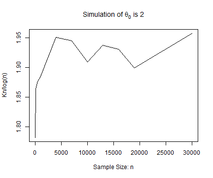
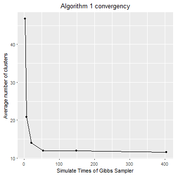

---
## Contents

1. Stick-Breaking and Chinese Restaurant Process
2. Data Generating and Power Law
3. Dirichlet Process Mixture Models
4. Gibbs Sampling Algorithms
5. Simulation results

<!-- --- &radio -->

<!-- ## Who has higher creativity? -->

<!-- Who has higher creativity? -->

<!-- 1. Man -->
<!-- 2. Woman -->
<!-- 3. Engineer -->
<!-- 4. Artist -->

<!-- *** .hint -->
<!-- Creativity Diversity -->

<!-- *** .explanation -->

--- 
## Dirichlet Process

$DP$ is a random measure defined as: $$\mu = \sum^{\infty}_{n=1} p_n \delta_{\phi_n}, $$ where:

- $(p_n)_{n\in N}$ are random weights by stick-breaking construction with parameter $\theta$
- and $(\phi_n)_{n\in N} \overset{iid}{\sim} G_0$ is "the base measure". 

Therefore, $\mu \sim DP(\theta, G_0)$ has following repressentation: 

$$\begin{array}
  {rl}
  \mu & = \;  \displaystyle \sum^{\infty}_{i=1} \Big[ V_i \prod^{i-1}_{j=1}(1-V_j) \Big] \delta_{\phi_i} \\
  V_i & \overset{iid}{\sim} \; Beta(1, \theta) \\
  \phi_i & \overset{iid}{\sim} \; G_0
  \end{array}$$

---
## Simulation of Asymptotics

Asymptotics of $K_n$: Number of clusters

- Theorem: $\displaystyle \text{lim}_{n\rightarrow\infty}K_n/\text{log}n = \theta$ almost surely. $(\theta_0=2)$

---
## Simulation of Asymptotics

- Asymptotic distribution of $K_n$: $$\frac{K_n-\mathbb{E}K_n}{\sqrt{\text{Var}(K_n)}} \Rightarrow \mathcal{N}(0,1)$$

---
## MCMC & Gibbs Sampler

1. **Markov chain Monte Carlo simulation(MCMC):** is a general method based on drawing values of $\theta$ from approximate distributions and then correcting those draws to better approximate the target posterior distribution, $p(\theta|y)$. 

2. **Gibbs Sampler:** also called alternating conditional sampling. Each iteration draws each subset conditional on the value of all the others $(\theta = (\theta_1, \cdots , \theta_d))$.

---
## DPMM & Gibbs Sampler Algorithm

Simple Mixture Model: $$\begin{array} {l}
X|\theta_i \sim \mathcal{N}(\theta_i, 1) \\
\theta_i \sim G \\
G \sim DP(\alpha, G_0) \\
G_0 \sim \mathcal{N}(0,2) 
\end{array}$$

---
## DPMM & Gibbs Sampler Algorithm

The conditional distribution for Gibbs sampling is as following: 

$$\begin{array}
{rl}
\theta^t_{i}|\theta^t_{-i,y_i} \sim & \sum_{j\ne i} q_{i,j} \delta(\theta^t_j) + r_i H_i \\
q_{i,j} =                           & b F(y_i, \theta_j) \\
r_i =                               & b \alpha \int F(y_i, \theta)G_0(\theta) \\
\end{array}$$

Then: 
- Likelihood function: $F(y_i|\theta) = \frac{1}{\sqrt{2\pi}}e^{\frac{1}{2}(y_i - \theta)^2}$

- $\int{F(y_i, \theta)G_0(\theta)} = \frac{1}{\sqrt{6\pi}}e^{\frac{1}{6}(y_i)^2}$

- Posterior distribution $H_i = p(\theta|y_i)= \frac{P(\theta)P(y_i|\theta)}{P(y_i)}= \frac{1}{\sqrt{2\pi}\sqrt{2/3}}e^{\frac{1}{2 * (2/3)}(\theta - \frac{2}{3}y_i)^2}$

---
## DPMM & Gibbs Sampler Algorithm

$$\begin{array}
{ll}
\hline
\textbf{Algorithm:} & \text{Gibbs Sampler for DPMM}  \\
\hline
1.\mathbf{Input:}   & \mathbf{y} \in \mathbb{R}^n,\;  \\
    & \theta_i \in (0,1), i=1,\cdots, n \\
2. \mathbf{Repeat:} & (1) \;  q^*_{i,j} =  F(y_i, \theta_i) \\
                    & (2) \;  r^*_{i} = \int F(y_i, \theta_i) d G_0(\theta) \\
                    & (3) \;  b_{i} = 1/(\sum^n_{j=1} q^*_{i,j} + r^*_{i} ) \\
                    & (4) \;  \text{Draw} \; \theta^t_{i}|\theta^t_{-i,y_i} \sim \sum_{j\ne i} q_{i,j} \delta(\theta^t_j) + r_i H_i \\
                    & (5) \;  \text{Update} \; i=1, \cdots, n \\
3. \mathbf{Deliver:} & \hat\theta = \theta^{(t)} \\
\hline
\end{array}$$

---
## Convergency of Algorithms 

Figure below shows the convergency of total number of clusters $(K_n)$ by changing iteration times $(M)$ of Gibbs Sampler(Algorithm 1). 

$(N=100, M\in (2,7,20,54,148,403), Rep=100)$

- Algorithm 1 converge very quick. 
- When $M>50$, total number of cluster from Gibbs Sampler is acceptable. 

---
## Convergency of Algorithms 

Histogram for every given M:

- Total number of cluster approach the truth ($n^0_c=10$)

<!-- 
 -->

</img>

---
## Stick-Breaking construction

Stick-breaking construction of Poisson-Dirichlet random partition $(0,θ)$.

Let $(V_n)_{n\in N}$ be i.i.d. $\text{Beta}(1,\theta)$ random variables.

That is, $P(V_1\in dx) = \theta (1 − x)^{\theta−1} \textbf{1}_{{x\in (0,1)} }dx.$

Consider
$$\begin{array}
  {rl}
  P_1 & := \;  V_1 \\
  P_2 & := (1-V_1)V_2 \\
  P_3 & := (1-V_1)(1-V_2)V_3 \\
      & \vdots \\
  P_{n+1} & := \displaystyle V_n \prod^{n-1}_{j=1}(1-V_j)
  \end{array}$$

---
## Stick-Breaking construction

<!-- 

 -->

</img>

---
## Animation of Chinese Restaurant Process (CRP)

<!-- 

 -->

</img>

