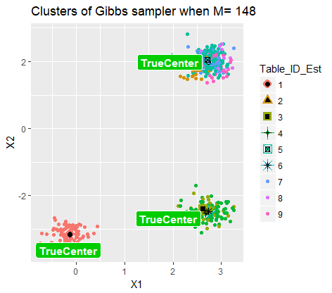
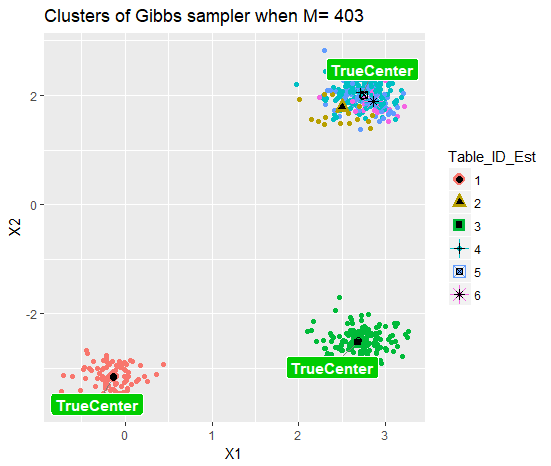

---
## Storyline

1. Motivation
2. Dirichlet Process Mixture Models
3. Gibbs Sampling Algorithm
4. Simulation results

--- 
## Motivation

Truth is complicated:

</img>

--- 
## Motivation

Truth is complicated:

</img>
</img>

--- 
## Motivation

Truth is complicated:

</img>

--- 
## Motivation

Truth is complicated:

</img>
</img>

--- 
## Dirichlet Process Mixture Model

$DP$ is a random measure defined as: $$\mu = \sum^{\infty}_{i=1} p_i \delta_{\phi_i}, $$ where:

- $(p_n)_{n\in N}$ are random weights by stick-breaking construction with parameter $\theta$
- and $G_0$ is "the base measure"

Therefore, $\mu \sim DP(\theta, G_0)$ has following repressentation: 

$$\begin{array}
  {rl}
  \mu & = \;  \displaystyle \sum^{\infty}_{i=1} \Big[ V_i \prod^{i-1}_{j=1}(1-V_j) \Big] \delta_{\phi_i} \\
  V_i & \overset{iid}{\sim} \; Beta(1, \theta) \\
  \phi_i & \overset{iid}{\sim} \; G_0
  \end{array}$$

---
## Animation of CRP
<!-- 

 -->

</img>

---
## MCMC & Gibbs Sampler

**Gibbs Sampler:** also called alternating conditional sampling. Each iteration draws each subset conditional on the value of all the others $(X = (X_1, \cdots , X_d))$.

1. Starts from an arbitrary state $\mathbf{X}^{(0)}=\mathbf{x}^{(0)}$
2. Moves with transition probability density: $$\mathbf{K}_G(\bf{x, y})=\prod^d_{\ell=1}\pi(y_\ell|\mathbf{y}_{1 : \ell -1}, \mathbf{x}_{\ell+1 : d})$$
3. Sample next state $\mathbf{X}^{(m)}$ from $K_G(\mathbf{X}^{(m-1)}, \mathbf{y})$
  
4. Sub-steps($\ell$-th): Sample $\mathbf{X}^{(m)}_\ell$ from $$\pi(x|\mathbf{X}^{(m)}_{1 : \ell -1}, \mathbf{X}^{(m-1)}_{\ell+1 : d})$$ 

---
## DPMM & Gibbs Sampler Algorithm

Simple Mixture Model: $$\begin{array} {l}
\mathbf{y}_i|\mathbf{\theta}_{i} \sim \mathcal{N}(\mathbf{\theta}_i, 1) \\
\theta_i \sim DP(\alpha, G_0) \\
G_0 \sim \mathcal{N}(0,2) 
\end{array}$$

In order to implement, explicit expression is <footnote content="Neal, R. M. (2000)."> needed </footnote>: $$\theta^t_{i}|\theta^t_{-i},y_i \sim \sum_{j\ne i} b_i F(y_i, \theta^t_j) \delta(\theta^t_j) + b_i \alpha \bigg[\int F(y_i, \theta)G_0(\theta)\bigg] H_i$$ 

$$b_i=\frac{1}{\sum_{j\ne i}F(y_i, \theta_j) + \alpha \int F(y_i, \theta)G_0(\theta)}$$

---
## DPMM & Gibbs Sampler Algorithm

  

- Likelihood function: $F(y_i|\theta_i) = \frac{1}{\sqrt{2\pi}}e^{-\frac{1}{2}(y_i - \theta_i)^2}$

- Posterior distribution $H_i = p(\theta|y_i)= \frac{F(y_i|\theta)G_0(\theta)}{\int{F(y_i|\theta)G_0(\theta)}}= \frac{1}{\sqrt{2\pi}\sqrt{2/3}}e^{\frac{(\theta - \frac{2}{3}y_i)^2}{2  (2/3)}}$

- $\int{F(y_i|\theta)G_0(\theta)} = \frac{1}{\sqrt{6\pi}}e^{\frac{1}{6}(y_i)^2}$

- or another simple way: $\Big(= \frac{F(y_i|\theta)G_0(\theta)}{H_i(\theta|y_i)}\Big)$

---
## Conjugate Prior is important

If the posterior distributions $p(\theta|y)$ are in the **same family as the prior probability distribution** $p(\theta)$ , the prior and posterior are then called conjugate distributions, and the prior is called **a conjugate prior** for the likelihood function.

**Model parameter** $\mathbf{\mu}$: mean of Normal with known variance $\Sigma$. 

Prior of $\mathbf{\mu}$ is $\mathcal{N}(\mathbf{\mu_0}, \Sigma_0)$

By derivation, posterior distribution is :

$$\mathcal{N}\Bigg(\Bigg(\Sigma^{-1}_0+\Sigma^{-1} \Bigg)^{-1} \Bigg(\Sigma^{-1}_0\mathbf{\mu_0}+\Sigma^{-1}\mathbf{y}\Bigg),\Bigg(\Sigma^{-1}_0+\Sigma^{-1} \Bigg)^{-1}\Bigg)$$

<!-- --- -->
<!-- ## DPMM & Gibbs Sampler Algorithm -->

<!-- The conditional distribution for Gibbs sampling is as following:  -->

<!-- $$\begin{array} -->
<!-- {rl} -->
<!-- \theta^t_{i}|\theta^t_{-i},y_i \sim & \sum_{j\ne i} q_{i,j} \delta(\theta^t_j) + r_i H_i \\ -->
<!-- q_{i,j} =                           & b_i F(y_i, \theta_j) \\ -->
<!-- r_i =                               & b_i \alpha \int F(y_i, \theta)G_0(\theta) \\ -->
<!-- \text{where } b_i \text{ satisfied}                                & \sum_{j\ne i}q_{i,j} + r_i = 1 -->
<!-- \end{array}$$ -->

---
## DPMM & Gibbs Sampler Algorithm

$$\begin{array}
{ll}
\hline
\textbf{Algorithm:} & \text{Gibbs Sampler for DPMM}  \\
\hline
1.\mathbf{Input:}   & \mathbf{y} \in \mathbb{R}^n,\;  \\
    & \theta^{(0)}_i \in (0,1), i=1,\cdots, n \\
    & \text{or} \;\theta^{(0)}_i = 0, i=1,\cdots, n \\
2. \mathbf{Repeat:} & (1) \;  q^*_{i,j} =  F(y_i, \theta^{(m)}_i) \\
                    & (2) \;  r^*_{i} = \alpha \int F(y_i, \theta^{(m)}_i) d G_0(\theta^{(m)}_i) \\
                    & (3) \;  b_{i} = 1/(\sum^n_{j=1} q^*_{i,j} + r^*_{i} ) \\
                    & (4) \;  \text{Draw} \; \theta^{(m)}_{i}|\theta^{(m)}_{-i,y_i} \sim \sum_{j\ne i} b_i q^*_{i,j} \delta(\theta^{(m)}_j) + b_i r^*_i H_i \\
                    & (5) \;  \text{Update} \; i=1, \cdots, n \\
3. \mathbf{Deliver:} & \hat\theta = \theta^{(m)} \\
\hline
\end{array}$$

---
## Convergency of one Markov chains

Start from a state with all *same* values:

  

</img>
</img>
</img>

---
## Convergency of one Markov chains

Start from a state with all *different* values:

  

</img>
</img>
</img>

---
## Convergency of Algorithm

Average total number of clusters $(K_n)$ v.s iteration times $(M)$ of Gibbs Sampler

$(n=1000, M\in (1,2,7,20,54,148,403))$

---
## Convergency of Algorithm

Histogram of 100 replications for every given M:

<!-- 
 -->

</img>

- Total number of clusters approach the truth (15) when M increases

---
## Inference of cluster center

Centers of clusters might be of interest to you. 

</img>
</img>

---
## Inference of cluster center

Animation of Centers of each cluster (100 simulation): 

</img>

---
## DPMM & Gibbs Sampler Algorithm

2D Simple Mixture Model: $$\begin{array} {rl}
\bigg(\begin{array}{c}y_{i,1}\\ y_{i,2}\\ \end{array}\bigg)|\bigg(\begin{array}{c} \theta_{i,1}\\ \theta_{i,2}\\ \end{array}\bigg) & \sim \mathcal{N}\bigg(\bigg(\begin{array}{c} \theta_{i,1}\\ \theta_{i,2}\\ \end{array}\bigg), \bigg(\begin{array}{cc}\sigma^2 & \\ & \sigma^2\\ \end{array}\bigg)\bigg) \\
\bigg(\begin{array}{c}\theta_{i,1}\\ \theta_{i,2}\\ \end{array}\bigg) & \sim DP(\alpha, G_0) \\
G_0 & \sim \mathcal{N}\bigg(\bigg(\begin{array}{c}0\\ 0\\ \end{array}\bigg), \bigg(\begin{array}{cc}\sigma^2_0 & \\ & \sigma^2_0\\ \end{array}\bigg)\bigg)
\end{array}$$

- Likelihood function: $F\bigg(\bigg(\begin{array}{c}y_{i,1}\\ y_{i,2}\\ \end{array}\bigg)|\bigg(\begin{array}{c} \theta_{i,1}\\ \theta_{i,2}\\ \end{array}\bigg)\bigg) = \frac{1}{\sqrt{2\pi}}e^{-\frac{1}{2}(\mathbf{y_{i\cdot}} - \theta_{i\cdot})^2}$

- Posterior distribution $H_i \sim \mathcal{N}\bigg(\frac{\sigma^2_0}{\sigma^2_0+\sigma^2}\bigg(\begin{array}{c}y_{i,1}\\ y_{i,2}\\ \end{array}\bigg), \frac{\sigma^2_0\sigma^2}{\sigma^2_0+\sigma^2}\bigg(\begin{array}{cc}1 & \\ & 1\\ \end{array}\bigg)\bigg)$ by formula in Wikipedia

--- 
## Gibbs Sampler results for 2D DPMM

Underlying clusters and estimated clusters from Gibbs Sample 
   

</img>

--- 
## Gibbs Sampler results for 2D DPMM

Underlying clusters and estimated clusters from Gibbs Sample 
   

</img>
</img>

--- 
## Gibbs Sampler results for 2D DPMM

Underlying clusters and estimated clusters from Gibbs Sample 
   

</img>
</img>

--- 
## Gibbs Sampler results for 2D DPMM

Underlying clusters and estimated clusters from Gibbs Sample 
   

</img>
</img>

---
## Take Aways 

    

- In 1D base measure setting, Algorithm converge very quick
- Starting from all same initialization performs better 
- In 1D base measure, when $M>50$, total number of cluster from Gibbs Sampler is acceptable, but it's not ture in 2D base measure 

